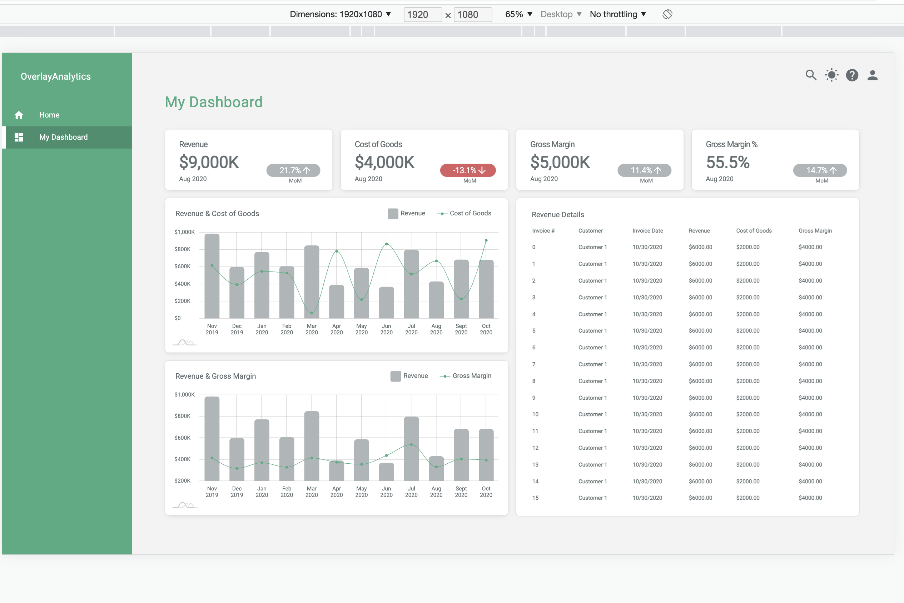

# You can run project locally

1. yarn build
2. create .env file with keys _REACT_APP_JWT_ and _REACT_APP_API_URL_
3. yarn start
4. go to _http://localhost:3000_ or another port if 3000 is already in use. See terminal output for details.
5. select _Dashboard_ from app menu

# Or you can see the project hosted at heroku

https://oa-dashboard-test.herokuapp.com/dashboard

You should see next result:

Also, you can find the code on Github:

https://github.com/semakalexander/oa-dashboard
